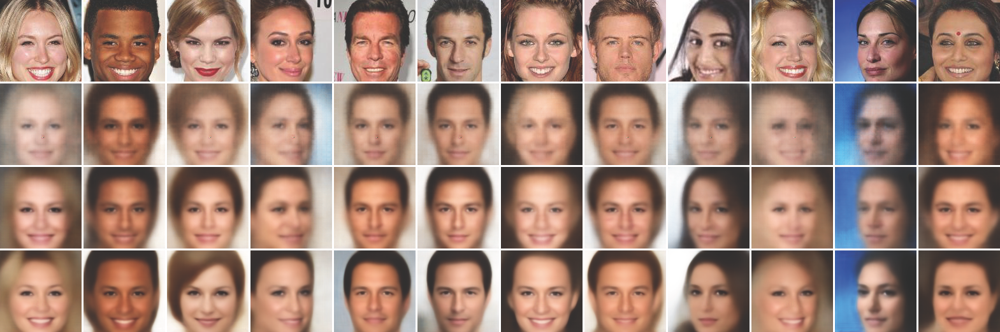

# Multi-Stage Variational Auto-Encoders for Coarse-to-Fine Image Generation

## Introduction

Multi-Stage Variational Auto-Encoders for Coarse-to-Fine Image Generation (MSVAE) is a way to generate high quality images. 

Detailed information about MSVAE is provided in [arXiv tech report] (https://arxiv.org/pdf/1705.07202.pdf).


## Citation

If using this code, please cite our paper.

```
@article{cai2017multi,
  title={Multi-stage variational auto-encoders for coarse-to-fine image generation},
  author={Cai, Lei and Gao, Hongyang and Ji, Shuiwang},
  journal={arXiv preprint arXiv:1705.07202},
  year={2017}
}
```

## Results



Comparison of reconstructed images from the CelebA dataset. The first row is the input
images in the CelebA training set. The second row is the reconstructed images generated by the
original VAE. The third and fourth rows are the results of deep residual VAE and multi-stage VAE,
respectively.

## System requirement

#### Programming language
Python

#### Python Packages
tensorflow (CPU) or tensorflow-gpu (GPU), numpy, h5py, progressbar, PIL, scipy

## Prepare data

We use celebA dataset in this work. CelebA is a large scale face dataset that contains 202599 face images. The size of each face
image is 178×218.  We resize the images to 128×128. Please save the dataset into h5 data format.

## Configure the network

All network hyperparameters are configured in main.py.

#### Training

max_step: how many iterations or steps to train

test_step: how many steps to perform a mini test or validation

save_step: how many steps to save the model

summary_step: how many steps to save the summary

#### Data

data_dir: data directory

train_data: h5 file for training

valid_data: h5 file for validation

test_data: h5 file for testing

batch: batch size

channel: input image channel number

height, width: height and width of input image

#### Debug

logdir: where to store log

modeldir: where to store saved models

sampledir: where to store predicted samples, please add a / at the end for convinience

model_name: the name prefix of saved models

reload_step: where to return training

test_step: which step to test or predict

random_seed: random seed for tensorflow

#### Network architecture

network_depth: how deep of the U-Net including the bottom layer

start_channel_num: the number of channel for the first conv layer

sigma: sigma value for reconstruction loss

## Training and Testing

#### Start training

After configure the network, we can start to train. Run
```
python main.py
```
The training of MSVAE will start.

#### Testing

Run
```
python main.py --action=predict
```
